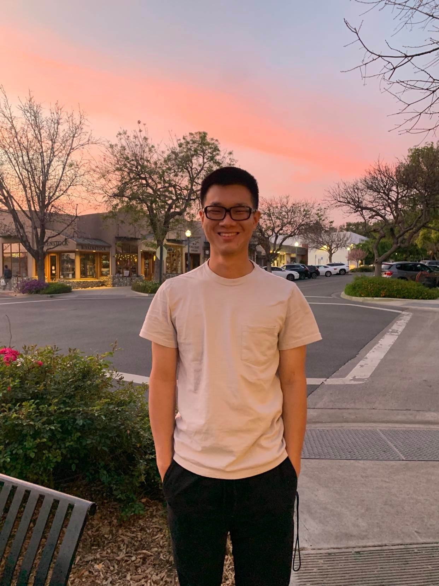

    
    
    

    
Hi! My name is Guy. I am a senior at Pomona College, majoring in computer science and mathematics (statistics track). My academic interests include statistics, data science, machine learning theory, and algorithms, to name a few. Some of my hobbies are playing board games, cooking, writing, world building, playing sports (soccer, tennis, badminton, basketball), and watching sports (Formula 1, NBA, NFL, Tennis, Soccer).

I am motivated by social good and the thrill of discovering and learning. I am a life-long learner looking to make an imapct.
    
---

## Contact Information

- Email: gthampak@gmail.com
- Phone #: +1(909)5066340
- github: [gthampak](https://github.com/gthampak)
- Website: You're on it

---

## Table of Contents

1. [Contact Information](#contact-information)
2. [Education](#education)
3. [Skills and Strengths](#skills-and-strengths)
4. [Work Experiences](#work-experiences)
5. [Teaching Experiences](#teaching-experiences)
6. [Research Experiences and Academic Projects](#research-experiences-and-academic-projects)
7. [Miscellaneous Projects](#miscellaneous-projects)
8. [Affiliations and Memberships](#affiliations-and-memberships)
9. [Extracurriculars and Additionals](#extracurriculars-and-additionals)
10. [Volunteer Work](#volunteer-work)

---

## Education

### Pomona College, Claremont, CA
- Expected Graduation: May 2023
- Majors: Computer Science and Mathematics (Statistics Track); Major GPA: 4.00, Cummulative GPA: 3.95

**Computer Science Coursework**
- Data Structures and Advanced Programming
- Advanced Data Structures
- Algorithms
- Computational Statistics (Machine Learning)
- Reinforcement Learning
- Managing Complex Systems (Software and Product Management)
- Programming Languages
- Theory and Computation
- Computer Systems
- Functional Programming
- Discrete Mathematics
- Senior Seminar

**Mathematics Coursework**
- Calculus Sequence (I, II, III)
- Linear Algebra
- Advanced Linear Algebra
- Real Analysis
- Probability Theory
- Statistical Theory
- Methods in Biostatistics (Machine Learning) (link)
- Computational Statistics (Machine Learning) (link)
- Bayesian Statistics (link)
- Senior Thesis (Maybe Foundations/Mathematics of Neural Networks)

**Other Coursework:** Spacetime-Quanta-Entropy, Foundations of Modern Physics (Introduction to Quantum Mechanics), Genetics, Cell Chemistry and Biology, Psychology, General Chemistry, Organic Chemistry (I, II), Writing Theory, Literary Interpretation, Zoroastrianism, Basic Acting, Hip-Hop Dance

### International School Bangkok, Bangkok, Thailand
- Class of 2019

**International Baccalaureate (IB) Coursework:** 
- Higher Level Courses - Computer Science, Mathematics, Physics, Chemistry, Mathematics, Economics, Further Mathematics
- Standard Level Courses - English A Language and Literature, Chinese A Language and Literature

---

## Skills and Strengths

#### Programming Languages:
- Expert: Java, Python, R
- Proficient: C++, C, Haskell, Gallina (Coq)
- Prior Experience: C#, SQL, HTML

#### Languages:
- English: Native in Speaker, Reader, Writer
- Thai: Native Speaker, Reader; Proficient Writer
- Chinese: Proficient Speaker, Reader, Writer

#### Other Skills:
- Git, Linux, LaTeX, Microsoft Office, Presentation
- Statistical/Machine Learning Tools Used: t-tests, linear models, simulation/permutation methods, Fisher's exact test, logistic models, survival curves, hierarchical models, Metropolis Hastings Algorithm, Gibbs sampler, Bootstrapping, k-nearest neighbors, random forests, bagging, support vector machines, clustering, etc.

#### Personal Strengths
- Hardworking, Fun, Life-long Learner
- Collaboration and Team Building
- Logic, Creativity, and Critical Thinking

---

## Work Experiences

**Software Developer**, Pomona College Funded *(Summer 2021)*
- Look under [Research Experiences and Academic Projects](#research-experiences-and-academic-projects) for more information.

**Lab Development Assistant**, Pomona College Physics Department *(Mar 2020 – May 2021)*
- Spring 2020: Assisted in research, design, and planning of remote online labs for General Physics courses during the 2020-21 academic year.
- Fall 2020/Spring 2021: Tested, ran, and gave feedback on designed labs.
    
**Research and Investments Assistant**, Finansia Syrus Securities, Bangkok, Thailand *(Summer 2017)*
- Analyzed and reported on trends and advanced metrics of stocks in the Thai stock market and reported to senior researchers.

---

## Teaching Experiences

**Teacher Assistant**, Pomona College Mathematics, Computer Science, and Physics Departments *(Fall 2020 - Present)*

- Hold office hours for students in the class to come to for review, homework and content help, or just talk and hang out.
- Run learning communities where I am responsible for the success of and meetings/review sessions with cohorts of students in the class.
- **Fall 2022:** Advanced Linear Algebra, Computational Statistics (Machine Learning)
- **Spring 2022:** Languages and Theory of Computation, Biostatistics
- **Fall 2021:** Probability Theory, Discrete Math and Functional Programming, Statistics
- **Spring 2021:** Probability Theory, Discrete Math and Functional Programming, Statistics
- **Fall 2020:** Statistics, General Physics

---

## Research Experiences and Academic Projects

- Yale Summer Undergraduate Math Research: Directed Graph Based Inference in Machine Learning *(Summer 2022)*
    - Goals are to discover new metrics for directed graphs, design algorithms for informative embeddings, and incorporate these into graph neural networks computations to define classes of methods for graph attention, graph filtering, and message passing and aggregation.

- Software Developer - Evaluation and Optimization of Traffic Control using Original Software *(Summer 2021 - Present)*
    - Programmed traffic simulator and optimizer in Java using graph theory (https://github.com/gthampak/BangkokTrafficRaise2021)
    - Used Victory Monument Area in Bangkok, Thailand as case study (irregular (non-grid) road network with high traffic congestion)
    - Pomona College RAISE Project; Summer 2021 Poster [here](https://drive.google.com/file/d/1zXCkl2yBgHi1qebSK-ckUoWIixA8NvKT/view?usp=sharing).

- [PeNNdulum: A Neural Networks-Physics Project](https://gthampak.github.io/physinet.io/) *(Fall 2021)*
    - https://gthampak.github.io/physinet.io/
    - Trained four types of Neural Networks compared their effectiveness in forecasting double pendulum motion.
    - LNN is clearly the best model as it preserves the total energy of the system, resulting in realistic path predictions. ESN and LSTM
predictions appear random with extreme discontinuity with respect to laws of physics between timesteps. The baseline model did not
capture any information on system dynamics and predicted one position for all time steps to minimize error.

- [Covid Mirrors Geography](https://github.com/gthampak/covid-mirrors-geography) *(Fall 2021)*
    - https://github.com/gthampak/covid-mirrors-geography
    - Performed Principal Component Analysis (machine learning) on OWID covid dataset and applied k-means clustering over 700+ days.
    - Countries in the same region tend to be clustered together daily which we animated beautifully onto a world map.

- UCLA DATAFEST *Springs*
    - [2022:]((https://github.com/tyxiang0530/FreeGourds2022)) Investigated Player Engagement in Yale Med’s School’s Elm City Stories Game (https://github.com/tyxiang0530/FreeGourds2022)
        - Worked with over 2 million data points; gained insight on player engagement and game efficacy in sex and drug education.
    - [2021:](https://github.com/Amber-Patricia-Lee/ShareThaiDatafest) Exploration, investigation, and analysis of drug-use dataset 
    - [2020:](https://github.com/tyxiang0530/Datafest---2020)
        - Effect of the Covid-19 Pandemic on Sentiment Scores of Popular Videos on Youtube (in the U.S., U.K., India, Australia, Canada)
        - Award: UCLA DataFest Judges’ Award: Best Data Collection

- Equity in STEM: Pomona College Physics and Astronomy Department-wide Blind Grading Proposal *(Fall 2020)*
• (https://docs.google.com/document/d/1qjukCdKNuvg5FJ2znXxIV7GFMgQ1L573WaCClTOo6ZM/edit?usp=sharing)

- Genetics (Wet Lab) and Database Project, Pomona College *(Spring 2020)*
    - Title: Observing E. Coli Genetics in Relation to Biofilm Formation of Wild-Type and Mutant E. Coli Using Dictyostelium
    - Identified genes responsible for formation and characteristics of bacterial biofilms through phagocytosis of Dictyostelium.

- International Baccalaureate Extended Essay in Statistical Chemistry *(Fall 2017 - Fall 2018)*
    - Statistical Investigation of Deviation of Actual-Theoretical Bond Enthalpies from Average Bond Enthalpies in Organic Compounds.
    - Model predicted deviations to 0.1% accuracy for straight chained alkanes.

- International Baccalaureate Mathematics Assessment Research Paper *Fall 2018 - Spring 2019*
    - Modeled Relationship Between NBA Players’ Age, Efficiency, and Salary to Determine Length and Value of Next Contract

---

## Miscellaneous Projects

- Strategy Game (Board Game/Computer Game)*(Spring 2020 - Present)*
    - Game design and hand-made physical prototype done.
    - [Software/Code](https://github.com/gthampak/guy_battlefield_board_game) in very early stages, still finalizing rules of physical copy.
    - Full Design Process, rulebook, trial game plays can be found [here](https://drive.google.com/drive/u/0/folders/1UNf2OuDfHQTyuT-Jkk5Acnxx5ir3JauA).

---

## Affiliations and Memberships
- American Statistical Association *(2020 - 2021)*
- International Honor Society Fall *(2017 – Spring 2019)*
- National Honor Society Fall 2016 – *(Spring 2019)*

---

## Extracurriculars and Additionals

- Pomona College International Student Mentor *(Fall 2020 – Present)*

- #rfordatascience-tidytuesday *(Fall 2020 – Present)*

- Thai Student Association of The Claremont Colleges Aug 2019 – Present
    - Provide an inclusive platform for all students affiliated to Thailand, as well as their friends, to network, socialize, and destress in a fun and active manner. Plan monthly social events.
    - Perform community service around Bangkok. Past project examples: Volunteer at the blind foundation and daycares located in Bangkok slums, made recycled paper from used ones.

- 5C Poker Club *(Fall 2019 – Present)*

- 5C Board Game Group *(Fall 2019 – Present)*

- Pomona-Pitzer Varsity Soccer Team *(Fall 2019 - Spring 2020)*

- Claremont Colleges Club Soccer *(Fall 2021 – Present)*

- Pomona College Orchestra (French Horn) *(Fall 2019 - Spring 2021)*

- International School Bangkok Science Society (President) *(Fall 2015 - Spring 2019)*
    - ISB HSSS aims to: 
        1. Teach local Thai students the scientific method and lab skills and lead lab work and research projects for students from under resourced local schools.
        2. Explore, investigate, and discuss current and captivating scientific knowledge, research, and studies. 
        3. Provide opportunities for research beyond the classroom. 
        4. Brainstorm innovative ways to express shared passions for the sciences.
    - Facilitated 14 service outreach projects, introduced biweekly ‘science in the news’ presentations, planned and asked school for independent research funding for members of the science society and others.

---

# Volunteer Work

- Math Circle Mentor *(Spring 2020 – Summer 2020)*
    - Mentor 3-4 students 2 hours a week through fun math games, activities, and problems.

- ISB Soles4Souls *(Fall 2016 – Spring 2019)*
    - Distribute and redistribute shoes to students in less fortunate communities to increase travel safety on foot.
    - Our first shoe drive program collected shoe donations from the ISB and Nichada community and donated secondhand shoes to Wat Koo kindergarten school (200 pairs collected). 
    - Our successive projects comprised of searching for sponsors and selling shoe bags to raise funds to buy new shoes for kids in local foundations such as the Home for Hope foundation (500+ pairs donated).

- ISB Student Ambassadors *(Fall 2014 – Spring 2019)*
    - Welcomed and took care of 3-5 new students each semester to help make their transition to a new school be as smooth as possible.
 
- English Education Service Trip to Ubon Ratchathani, Thailand *(Summer 2016)*
    - Organized donation drive for school supplies and taught English to 150 Thai primary school kids in rural areas of Ubon Ratchathani.

---
