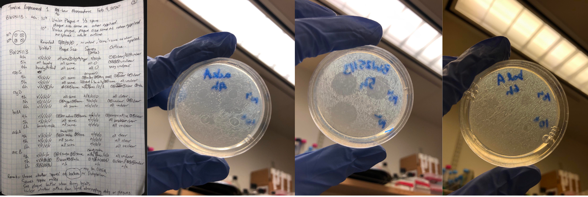

    
    
    

    
Hi! My name is Guy. I am a senior at Pomona College, majoring in computer science and mathematics (statistics track). My academic interests include machine learning theory, statistics, algorithms, and data science, to name a few. Some of my hobbies are playing board games, cooking, writing, world building, playing sports (soccer, tennis, badminton, basketball), and watching sports (Formula 1, NBA, NFL, Tennis, Soccer).

I am motivated by social good and the thrill of discovering and learning. I am a life-long learner looking to make an impact. Have an awesome day!
    
---

## Contact Information

- Email: gthampak at gmail dot com
- Phone #: +1 nine-O-nine 5O6 6threeforty
- github: [gthampak](https://github.com/gthampak)
- Website: [You're on it](https://gthampak.github.io/guythampakkul/)

---

## Table of Contents

1. [Contact Information](#contact-information)
2. [Education](#education)
3. [Skills and Strengths](#skills-and-strengths)
4. [Work Experiences](#work-experiences)
5. [Teaching Experiences](#teaching-experiences)
6. [Research Experiences and Academic Projects](#research-experiences-and-academic-projects)
7. [Miscellaneous Projects](#miscellaneous-projects)
8. [Affiliations and Memberships](#affiliations-and-memberships)
9. [Extracurriculars and Additionals](#extracurriculars-and-additionals)
10. [Volunteer Work](#volunteer-work)

---

## Education

### Pomona College, Claremont, CA
- Expected Graduation: May 2023
- Majors: Computer Science and Mathematics (Statistics Track); Major GPA: 4.00, Cummulative GPA: 3.96

**Computer Science Coursework**
- Data Structures and Advanced Programming (in Java)
- Advanced Data Structures (in C++)
- Algorithms (in Python)
- Computational Statistics (Machine Learning) (in R)
- Reinforcement Learning
- Managing Complex Systems (Software and Product Management) (AWS)
- Programming Languages (in Haskell)
- Theory and Computation (in Haskell)
- Computer Systems (in C)
- Functional Programming (in Gallina/Coq)
- Discrete Mathematics
- Senior Seminar

**Mathematics Coursework**
- Calculus III
- Linear Algebra
- Advanced Linear Algebra
- Real Analysis
- Probability Theory
- Statistical Theory
- Methods in Biostatistics (Machine Learning) (in R)
- Computational Statistics (Machine Learning) (in R)
- Bayesian Statistics (in R)
- Senior Thesis (Maybe Foundations/Mathematics of Neural Networks)

**Other Coursework:** Spacetime-Quanta-Entropy, Foundations of Modern Physics (Introduction to Quantum Mechanics), Genetics, Cell Chemistry and Biology, Psychology, General Chemistry, Organic Chemistry (I, II), Writing Theory, Literary Interpretation, Zoroastrianism, Basic Acting, Hip-Hop Dance

### International School Bangkok, Bangkok, Thailand
- Class of 2019

**International Baccalaureate (IB) Coursework:** 
- Higher Level Courses - Computer Science, Mathematics, Physics, Chemistry, Economics, Further Mathematics
- Standard Level Courses - English A Language and Literature, Chinese A Language and Literature

[[Back to Table of Contents]](#table-of-contents)

---

## Skills and Strengths

#### Programming:
- Expert: Java, Python, R
- Proficient: C++, C, Haskell, Gallina (Coq)
- Prior Experience: C#, SQL, HTML, Pytorch

#### Languages:
- English: Native in Speaker, Reader, Writer
- Thai: Native Speaker, Reader; Proficient Writer
- Chinese: Proficient Speaker, Reader, Writer

#### Other Skills:
- Git, Linux, LaTeX, Microsoft Office, Presentation
- Statistical/Machine Learning Tools Used: t-tests, linear models, simulation/permutation methods, Fisher's exact test, logistic models, survival curves, hierarchical models, Metropolis Hastings Algorithm, Gibbs sampler, Bootstrapping, k-nearest neighbors, random forests, bagging, support vector machines, clustering, etc.

#### Personal Strengths
- Hardworking, Fun, Life-long Learner
- Collaboration and Team Building
- Logic, Creativity, and Critical Thinking

[[Back to Table of Contents]](#table-of-contents)

---

## Work Experiences

**Software Developer**, Pomona College Funded *(Summer 2021)*
- Look under [Research Experiences and Academic Projects](#research-experiences-and-academic-projects) for more information.

**Lab Development Assistant**, Pomona College Physics Department *(Mar 2020 – May 2021)*
- Spring 2020: Assisted in research, design, and planning of remote online labs for General Physics courses during the 2020-21 academic year.
- Fall 2020/Spring 2021: Tested, ran, and gave feedback on designed labs.
    
**Research and Investments Assistant**, Finansia Syrus Securities, Bangkok, Thailand *(Summer 2017)*
- Analyzed and reported on trends and advanced metrics of stocks in the Thai stock market and reported to senior researchers.

[[Back to Table of Contents]](#table-of-contents)

---

## Teaching Experiences

**Teacher Assistant**, Pomona College Mathematics, Computer Science, and Physics Departments *(Fall 2020 - Present)*

- Hold office hours for students in the class to come to for review, homework and content help, or just talk and hang out.
- Run learning communities where I am responsible for the success of and meetings/review sessions with cohorts of students in the class.
- Grade homeworks.
- Classes Mentored
    - **Fall 2022:** Advanced Linear Algebra, Computational Statistics (Machine Learning)
    - **Spring 2022:** Languages and Theory of Computation, Biostatistics
    - **Fall 2021:** Probability Theory, Discrete Math and Functional Programming, Statistics
    - **Spring 2021:** Probability Theory, Discrete Math and Functional Programming, Statistics
    - **Fall 2020:** Statistics, General Physics

[[Back to Table of Contents]](#table-of-contents)

---

## Research Experiences and Academic Projects

### Project List
- [Yale Summer Undergraduate Math Research (NSF REU): Directed Graph Based Inference in Machine Learning](#yale-summer-undergraduate-math-research-nsf-reu-directed-graph-based-inference-in-machine-learning-summer-2022)
- [Evaluation and Optimization of Traffic Control using Original Software](#evaluation-and-optimization-of-traffic-control-using-original-software-github-summer-2021---present)
- [PeNNdulum: A Neural Networks-Physics Project](#penndulum-a-neural-networks-physics-project-github-fall-2021) (Predicting Chaotic Systems -- Double Pendulum Motion)
- [Covid Mirrors Geography](#covid-mirrors-geography-github-fall-2021)
- [UCLA Datafest](#ucla-datafest-springs) (3x)
- [Equity in STEM: Pomona College Physics and Astronomy Department-wide Blind Grading Proposal](#equity-in-stem-pomona-college-physics-and-astronomy-department-wide-blind-grading-proposal-fall-2020)
- [Genetics (Wet Lab) and Database Assistantship](#genetics-wet-lab-and-database-research-assistantship-pomona-college-spring-2020)
- International Baccalaureate Extended Essay in Statistical Chemistry (Modeling actual bond enthalpies with theoretical bond enthalpies in organic compounds)
- International Baccalaureate Mathematics Assessment Research Paper (Modeling NBA Player Efficiency and Salaries)

### Yale Summer Undergraduate Math Research (NSF REU): Directed Graph Based Inference in Machine Learning *(Summer 2022)*
- Directed Graph Based Inference in Machine Learning 
    - Explore new metrics for directed graphs, design algorithms for informative embeddings, and incorporate these into graph neural networks computations to define classes of methods for graph attention, graph filtering, and message passing and aggregation.
- Diffusion curvature and Hessian approximations
    - Develop a notion of curvature for point cloud data that relies on the diffusion geometry framework and exploring applications of this ‘diffusion curvature’ to Hessian approximation, gradient descent, loss landscapes, and other applications in data geometry.
- General [github](https://github.com/professorwug/SUMRY-2022).
- [github](https://github.com/professorwug/losscurves) for refining the diffusion curvature algorithm and understanding loss curves through implementation.

[[Back to Top of Research Experiences and Academic Projects]](#research-experiences-and-academic-projects)

### Evaluation and Optimization of Traffic Control using Original Software [[github]](https://github.com/gthampak/BangkokTrafficRaise2021) *(Summer 2021 - Present)*
- Started as a Pomona funded RAISE (Remote Alternative Independent Summer Experience) project, but turned into more.
- Programmed traffic simulator and optimizer in Java using graph theory. Software can currently run a bug-free complete graphical road network with cars displayed in ASCII in the console with moderate simulation interactions.
- Mostly worked on this project during the summer of 2021. However, I remain incredibly excited about this project and would come and work on it and add research questions to test with the program from time to time. This project is one I use to learn new things and continue to use it to learn new languages and interfaces.
- Worked with and interviewed Thai (traffic) police officers, Thai ministry of transportation, Bangkok Traffic and Transportation Department.
- Use Victory Monument Area in Bangkok, Thailand as case study (irregular (non-grid) road network with high traffic congestion).
- Pomona College RAISE Project; Summer 2021 Poster [here](https://drive.google.com/file/d/1zXCkl2yBgHi1qebSK-ckUoWIixA8NvKT/view?usp=sharing).
- Original Goals:
    1. Research methods of traffic management and control in Bangkok,
    2. Synthesize available data on Bangkok traffic (in specific areas and intersections), 
    3. Investigate potential ways to alleviate traffic; experiment with different traffic light configurations and levels of human interaction in semi-autonomous systems.
- Updated Short-term goals
    - Improve lane change accuracy and behavior.
    - Be able to set specific paths for cars individually to more accurately simulate rush hour traffic flow. 
    - Analyze the success rate of cars taking specific routes through the road network under different conditions to get an idea of the effectiveness of the implemented lane changing algorithm.
    - Transfer code to platform with better UI and start working on front-end development.
- Updated Long-term goals
    - Test software with larger scale road networks (full cities and towns) and evaluate efficiency of back-end implementations.
    - Make the software field testable by police officers.
    - Research traffic measurement metrics and add them to the software to evaluate the efficiency of different methods of traffic control and traffic light configuration.
    - Implement different algorithms for cars and observe how they interact. Evaluate how different driving behavior affects trafficby vary proportions of cars with respective driving behaviors and tendencies.
    - Potential uses of software in urban planning, simulating new road networks and their respective traffic levels under different conditions before they're built, etc.

[[Back to Top of Research Experiences and Academic Projects]](#research-experiences-and-academic-projects)

### PeNNdulum: A Neural Networks-Physics Project [[github]](https://gthampak.github.io/physinet.io/) *(Fall 2021)* 
- Trained Fully Connected, Long Short-term Memory Recurrent, Echo State, and Lagrangian Neural Networks’ and compared their effectiveness in forecasting double pendulum motion (a chaotic system).
- Used PyTorch for baseline models, and modeled Echo State and Langragian Networks based on example models (linked on project webpage).
- The goal is explore if the LNN is capable of outperforming a more general-purpose neural network that is highly successful at predicting the behavior of chaotic systems, Reservoir Computing (RC), the long-short term memory neural network (LSTM), which is excellent at forecasting sequential tasks, as well as a baseline fully-connected neural network model (FC).
- LNN is clearly the best model as it preserves the total energy of the system, resulting in realistic path predictions. ESN and LSTM predictions appear random with extreme discontinuity with respect to laws of physics between timesteps. The baseline model did not capture any information on system dynamics and predicted one position for all time steps to minimize error.
- I was responsible for the write-up and contributed to designing and training each neural network.

    
    
    

[[Back to Top of Research Experiences and Academic Projects]](#research-experiences-and-academic-projects)

### Covid Mirrors Geography [[github]](https://github.com/gthampak/covid-mirrors-geography) *(Fall 2021)* 
- Inspired by [paper](https://www.nature.com/articles/nature07331) *Genes Mirror Geography Within Europe* published on Nature. 
- We wanted to investigate the similarities and differences countries in similar situations during the pandemic.
- We used clustering and PCA which makes our methods generalizable to other datasets since we do not have to tune a model or perform
large amounts of wrangling to use our analysis on related data.
Performed Principal Component Analysis (machine learning) on OWID covid dataset and applied k-means clustering over 700+ days.
An interesting finding from our analysis is that countries in the same region tend to be clustered together daily. We suspected that this was because many identifier variables of these countries (continent, etc.) may be similar so there were clustered together. However, when we removed these variables and only hand-picked those that are purely pandemic related and are less likely to identify the regions of the countries, we got very similar clusters from the principal components, which is extremely interesting. This result was animated onto a world map.

    
    
    

[[Back to Top of Research Experiences and Academic Projects]](#research-experiences-and-academic-projects)

### UCLA DATAFEST *(Springs)* 
- (Click on year to access respective github repositories)
- [2022:]((https://github.com/tyxiang0530/FreeGourds2022)) Investigated Player Engagement in Yale Med’s School’s Elm City Stories Game
    - [Google drive](https://drive.google.com/drive/folders/1XB1prYkBzXWnu-iwuiSdd577bAZ8rVAQ) with detailed notes, presentation, presentation outline, etc.
    - Worked with over 2 million data points of unpublished data on Elm City Stories, a game designed by Yale's play2Prevent Lab.
    - I was responsible for data wrangling, data cleaning and manipulation, data analysis and data visualizations.
    - We concluded that the outcome variable ("S5 scores" from surveys conducted to evaluate effectiveness of game in preventing feelings towards drug use) is highly flawed and were not collected consistently enough to inform us of the true effectiveness of the game. This conclusion is supported by a paper later published on the game's data which had much more comprehensive and fine-grained metrics through more detailed surveys to evaluate the effcetiveness of the game as well.
    - However, we did see some promising trends that the game boost confidence in making correct decisions in real life situations involving drugs for players with high engagement.

    
    
    

- [2021:](https://github.com/Amber-Patricia-Lee/ShareThaiDatafest) Exploration, investigation, and analysis of drug-use dataset [(github)](https://github.com/Amber-Patricia-Lee/ShareThaiDatafest)
    -  [Google Drive](https://drive.google.com/drive/u/0/search?q=sharethai) with final presentation slides, brief summary of findings, and presentation video.
    -   Worked with a U.S. 2018 Drug-use dataset. 
    -   I was responsible to exploratory data exploration and data visualization and building logistic regression models for predicting use of opiods inluding variable selection, feature engineering, cross validating, and more.
    -   One interesting (but incomplete, because we ran out of time) finding from this project was the correlation between sentiment and valence scores of tweets in different states and drug use.
    -   This experience was especially unique due to our teams' circumstances; it was a completely remote datathon in the middle of the pandemic. We did not achieve as much as we thought we would. Due to the pandemic, we had members working from three different countries in four different time zones, which led to challenges in communication and continuation. We learned a lot from this and by the end of the weekend wrote much more detailed notes and set clear goals for others to follow.

- [2020:](https://github.com/tyxiang0530/Datafest---2020) Effect of the Covid-19 Pandemic on Sentiment Scores of Popular Videos on Youtube (in the U.S., U.K., India, Australia, Canada) [(github)](https://github.com/tyxiang0530/Datafest---2020)
    - Award: UCLA DataFest Judges’ Award: Best Data Collection
    - [Google Drive](https://drive.google.com/drive/u/0/folders/1MyY3tUPC5bkpHQG8ajxyuiQ8xhpZGkkl) with brief final report, final data analysis reports, data visualizations, data, and final video.
    - We used data from the John Hopkins Covid dataset in mid March 2020, used Youtube API to access transcripts of popular youtube videos and performed sentiment analysis on them.
    - This was a unique experience as we were not given a dataset at all and had two weeks to work on the project as opposed to one weekend.
    - I was in charge of project brainstorming, data cleaning, wranggling, and organization, data exploration and analysis, and data visualizations.
    - We found that in a select few categories, the proportion of popular videos with positive senitment were different before and after the Covid outbreak. However, in most categories across all countries, the sentiment scores of popular videos remained the same. We speculate that this lack of difference may be due to the relative job security of popular YouTubers, as well as the generally manufactured personality that is imprinted upon large and more ‘methodical’ YouTube channels. Despite conditions worsening, perhaps large YouTube personalities must maintain their ‘personalities’ to preserve their view count and income.

[[Back to Top of Research Experiences and Academic Projects]](#research-experiences-and-academic-projects)

### Equity in STEM: Pomona College Physics and Astronomy Department-wide Blind Grading Proposal *(Fall 2020)*
- [Link](https://docs.google.com/document/d/1qjukCdKNuvg5FJ2znXxIV7GFMgQ1L573WaCClTOo6ZM/edit?usp=sharing) to proposal to Physics department.
- We investigated biases in grading of student works by Professors and student graders (teaching assistants) and proposed a series of research and study supported steps and methods that could help reduce biased grading.

    
    
    

[[Back to Top of Research Experiences and Academic Projects]](#research-experiences-and-academic-projects)

### Genetics (Wet Lab) and Database Research Assistantship, Pomona College *(Spring 2020)*
- Title: Observing E. Coli Genetics in Relation to Biofilm Formation of Wild-Type and Mutant E. Coli Using Dictyostelium
- Identified genes responsible for formation and characteristics of bacterial biofilms through phagocytosis of Dictyostelium.
- I was responsible for maintaining Dictyostelium cultures and running Dictyostelium - E. Coli phagocytosis trials from start to finish. 
- I created an started a database for past and new data (images and all relevant variables and information) that is much easier to access and look through. While this project has been ongoing for a while, collected data was somewhat scattered so the database makes it easier for future students and/or collaborators of the research project to get caught up and understand where the project is at.
- I ran over 300 successful E Coli.-Dictyostelium petri dish trials, and spent the rest of my time setting up the database and writing documentation for how to access it.

    
    
    

[[Back to Top of Research Experiences and Academic Projects]](#research-experiences-and-academic-projects)

### International Baccalaureate Extended Essay in Statistical Chemistry *(Fall 2017 - Fall 2018)*
- Statistical Investigation of Deviation of Actual-Theoretical Bond Enthalpies from Average Bond Enthalpies in Organic Compounds.
- Model predicted deviations to 0.1% accuracy for straight chained alkanes.
- [Link](https://drive.google.com/file/d/1e4cRi6ixVmxbSszGucOds3TGMncmFS_M/view?usp=sharing) to paper.

[[Back to Top of Research Experiences and Academic Projects]](#research-experiences-and-academic-projects)

### International Baccalaureate Mathematics Assessment Research Paper *Fall 2018 - Spring 2019*
- Modeled Relationship Between NBA Players’ Age, Efficiency, and Salary to Determine Length and Value of Next Contract

[[Back to Top of Research Experiences and Academic Projects]](#research-experiences-and-academic-projects)
[[Back to Table of Contents]](#table-of-contents)

---

## Miscellaneous Projects

- Strategy Game (Board Game/Computer Game)*(Spring 2020 - Present)*
    - Game design and hand-made physical prototype done.
    - [Software/Code](https://github.com/gthampak/guy_battlefield_board_game) in very early stages, still finalizing rules of physical copy.
    - Full Design Process, rulebook, trial game plays can be found [here](https://drive.google.com/drive/u/0/folders/1UNf2OuDfHQTyuT-Jkk5Acnxx5ir3JauA).

    
    
    

- Sci-fi and Cyberpunk World Building and Short Story Series

[[Back to Table of Contents]](#table-of-contents)

---

## Affiliations and Memberships
- American Statistical Association *(2020 - 2021)*
- International Honor Society Fall *(2017 – Spring 2019)*
- National Honor Society Fall 2016 – *(Spring 2019)*

[[Back to Table of Contents]](#table-of-contents)

---

## Extracurriculars and Additionals

- Pomona College International Student Mentor *(Fall 2020 – Present)*

- #rfordatascience-tidytuesday *(Fall 2020 – Present)*

- Thai Student Association of The Claremont Colleges Aug 2019 – Present
    - Provide an inclusive platform for all students affiliated to Thailand, as well as their friends, to network, socialize, and destress in a fun and active manner. Plan monthly social events.
    - Perform community service around Bangkok. Past project examples: Volunteer at the blind foundation and daycares located in Bangkok slums, made recycled paper from used ones.

- 5C Poker Club *(Fall 2019 – Present)*

- 5C Board Game Group *(Fall 2019 – Present)*

- Pomona-Pitzer Varsity Soccer Team *(Fall 2019 - Spring 2020)*

- Claremont Colleges Club Soccer *(Fall 2021 – Present)*

- Pomona College Orchestra (French Horn) *(Fall 2019 - Spring 2021)*

- International School Bangkok Science Society (President) *(Fall 2015 - Spring 2019)*
    - ISB HSSS aims to: 
        1. Teach local Thai students the scientific method and lab skills and lead lab work and research projects for students from under resourced local schools.
        2. Explore, investigate, and discuss current and captivating scientific knowledge, research, and studies. 
        3. Provide opportunities for research beyond the classroom. 
        4. Brainstorm innovative ways to express shared passions for the sciences.
    - Facilitated 14 service outreach projects, introduced biweekly ‘science in the news’ presentations, planned and asked school for independent research funding for members of the science society and others.

[[Back to Table of Contents]](#table-of-contents)

---

# Volunteer Work

- Math Circle Mentor *(Spring 2020 – Summer 2020)*
    - Mentor 3-4 students 2 hours a week through fun math games, activities, and problems.

- ISB Soles4Souls *(Fall 2016 – Spring 2019)*
    - Distribute and redistribute shoes to students in less fortunate communities to increase travel safety on foot.
    - Our first shoe drive program collected shoe donations from the ISB and Nichada community and donated secondhand shoes to Wat Koo kindergarten school (200 pairs collected). 
    - Our successive projects comprised of searching for sponsors and selling shoe bags to raise funds to buy new shoes for kids in local foundations such as the Home for Hope foundation (500+ pairs donated).

- ISB Student Ambassadors *(Fall 2014 – Spring 2019)*
    - Welcomed and took care of 3-5 new students each semester to help make their transition to a new school be as smooth as possible.
 
- English Education Service Trip to Ubon Ratchathani, Thailand *(Summer 2016)*
    - Organized donation drive for school supplies and taught English to 150 Thai primary school kids in rural areas of Ubon Ratchathani.

[[Back to Table of Contents]](#table-of-contents)

---

Thanks for making it this far! Feel free to reach out to talk about anything. [[Contact Information]](#contact-information).
